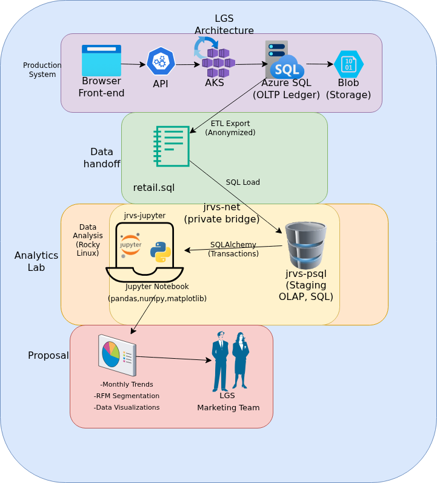

# Introduction
The London Gift Shop (LGS) is an established UK-based online giftware retailer experiencing stagnant top-line revenue despite possessing years of customer transaction logs. The core bottleneck stems from a critical data gap: without a dedicated analytics infrastructure, the marketing team cannot identify purchasing trends, profile customer behavior, or design data-driven promotions. This Proof of Concept (PoC) bridges that gap by establishing a lightweight data pipeline that transforms raw database records into actionable business intelligence. This initiative delivers a full analytics pipeline to ingest, clean, and profile two years of transactional records spanning December 2009 to December 2011. Utilizing a containerized architecture powered by a PostgreSQL data warehouse, Docker, and Python (Pandas, Matplotlib), the pipeline engineers structural customer features to isolate high-value accounts, uncover seasonal demand surges, and map an 11-tier RFM customer segmentation matrix.

Review the complete top-down codebase, data-cleaning workflows, and exploratory visualizations detailed below to see how these insights convert directly into high-yield, targeted marketing campaigns.

-PostgreSQL: Serves as the analytical data store housing historical ledger logs.

-Docker VM Environment: Isolates the system to guarantee deployment reproducibility on Rocky Linux.

-Python (Pandas, NumPy, Matplotlib): Powers the core programmatic data-wrangling engine, statistical distributions analysis, and behavioral feature engineering.

# Implementation

## Project Architecture

The analytical pipeline for this Proof of Concept (PoC) relies on a decoupled, non-intrusive staging architecture. This allows for deep behavioral data exploration without adding computational strain to production Online Transaction Processing (OLTP) layers.

The final transaction metrics point to three direct paths for the marketing team to stop stagnant growth and generate higher sales volume:

# Data Analytics and Wrangling

[LGS Retail Data Analytics & Wrangling](https://github.com/jarviscanada/jarvis_data_eng_SylvanLewis/blob/feature/python_data_analytics/python_data_analytics/data_wrangling_learning.ipynb)

# Improvements
- Build an Automated Data pipeline
Database records have to be exported and loaded by hand, If we use Apache Airflow, we can schedule regular automatic data pulls from the main server into the data warehouse on a preset timer, to monitor discrepancies.
- Create Automatic Product Grouping Tool
Dataset only contains messy text descriptions for items, so we can introduce them under categories that will sort the product into official categories, which aid in udnerstanding which product draw the most revenue
- Set Up a Monthly RFM Scoreboard
Current RFM scores are static because they exist as a one-time snapshot of historical tracking, a strong direction can make dynamic metrics by automatically recalculating the RFM metrics monthly.
